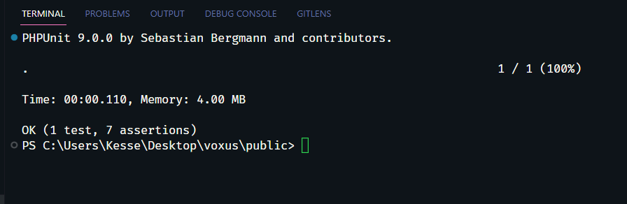
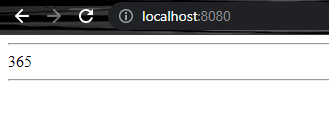

<h1 align="center">Teste PL - VOXUS 👋</h1>

## Instalação

- Após clonar o projeto, abra o powershell e navegue até o diretório one ele se encontra
- Rode um "docker-compose up -d" para instalar as imagens;
- Navegue até a pasta public do projeto;
- Dentro de public, utilize composer install para instalar o PHPUnit;
- Ainda em public, para acionar o teste, utilize "vendor\bin\phpunit tests" (Se estiver no linux, mudar a barra);
- Assim que for rodado os testes, será exibido o retorno no terminal;

- Caso queira testar o projeto via nginx, acesse "localhost:8080".

## Observações

_You may NOT use libraries or *language internal functions* that convert the string
to date or that calculates the day number of the year for the developer. You
must create your own logic to solve the problem._

Essa restrição me deixou um pouco confuso. Não poder utilizar "funções internas da linguagem" iria invibializar um pouco o processo, devido o PHP ser uma linguagem de alto nível.  Mesmo eu não utilizando as funções de date, ainda usaria outras funções internas. Sendo elas: intval(), checkdate(), array() entre outras. 

Portanto, uma boa lógica as vezes não é escrever um código complexo e com muitas linhas, mas sim, tirar o maior proveito possível da linguagem, utilizando o seu legado e suas facilitações, visando uma boa performance e fácil manutenção.